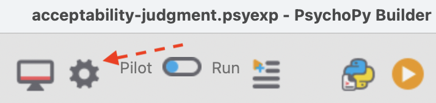
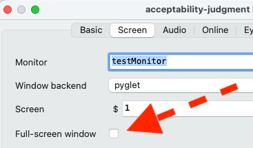

# Psychopy experiment templates

Code and data to support LING 805: Computational Methods for Linguists! Far more advanced templates are published by Pavlovia at https://gitlab.pavlovia.org/demos

## Requirements:

- Psychopy (I developed these scripts using v2025.1.1)
- A web browser (to use 'Pilot in browser' mode)

## Templates:

- `1-acceptability-judgment-simple`: a simple Likert scale acceptability judgment experiment. (We will recreate this in class). Participants provide a response and immediately advance to a subsequent trial. 
- `2-acceptability-judgment-advanced`: a more advanced Likert scale acceptability judgment experiment. Participants advance from trial to trial by pressing the space bar. Participants are prevented from advancing until they provide a Likert response. A code element handles random assignment to a between-subjects condition.

## Troubleshooting:

### Prevent full-screen in 'Pilot in browser' mode: 

1. Click the 'gear' icon ('Edit experiment settings') at the top toolbar. 



2. Tab over to the 'Screen' tab and un-check the 'Full-screen window' option. 



### Unable to demo experiment in 'Pilot in browser' mode: 


Check the 'port' on which the experiment is running. On my machine, web browser debug mode opens a broswer window at the address `http://localhost:12002/?__pilotToken=local`. This tells me that the port number is `12002`. (The number may be different on your machine). 

On Mac/Linux, I can 'clear' this port (kill all existing connections on it) by running the following line from the Terminal:

```
lsof -ti:12002 | xargs kill -9
```

On Windows, you can open the Powershell application and run the following command: 

```
Stop-Process -Id (Get-NetTCPConnection -LocalPort 12002).OwningProcess -Force
```

Clearing the port should address the issue. 
